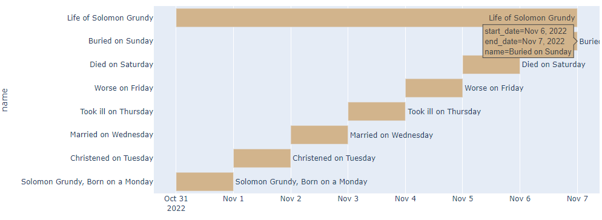

# Архитектура итогового проекта
Рабочее название итогового проекта - Worldbuilder. 

Worldbuilder - инструмент для авторов худождственных произведений и креативных коллективов. Он позволяет упорядочивать информацию о персонажах, сюжетах и мирах. 

Worldbuilder пригодится при создании проектов со сложной структурой повестования и целиком авторских миров. 

Написать небольшой рассказ о студенте из Перми, который делал программу на пайтоне, провалил дедлайны и иполучил низкую оценку, относительно просто. Ведь синопсис и концепция персонажа уложились в предложение. 

Но когда произведение разростается в роман с несколькими ключевыми персонажами, у которых свои линии повествования; когда персонажи обрастают подробностями, динамикой отношений и конфликтами; когда над проектом начинает работать целый коллектив; когда автор стремится создать оригинальный мир, то тогда возникают сложности. В произведении могут накапливаться логические недочёты и несостыковки.

В лучшем случае эти недочёты ищет сам автор при многократном перечитывании собственной работы, либо лит.редактор или креативный менеджер. В худшем случае эти надочёты находят потребители произведения.

Поэтому такие инструменты как Worldbuilder и необходимы.

**Цель проекта:** структурирование и визуализация данных о художественных произведениях. 

**Задачи:**
1. Создание wiki-подобных каталогов с информацией о мире произведения.

Пример структуры каталога
 

2. Визуализация и структурирование хода событий в произведении в виде timeline-диаграмм и таблиц

Пример реализованной визуализации
 

3. Визуализация связей персонажей в виде графов 

>Какого рода связи? 
 Например, персонажи могут быть связаны принадлежностью к одной семье, социальной группе, проживанием в одном месте и т.п.

## Работа с данными

**Ввод:** в поля вводится текстовая информация о каком-либо объекте произведения

**Обработка:** превращаение введёного описания в DataFrame. Каталогизация в соотв. с заданными значениями, 

**Вывод:** html-страницы в иерархически организованном каталоге, страница "Таймлайн" отображает диаграмму всех событий. Страница "Связи" визуализирует связи персонажей в виде графа по заданному признаку. 